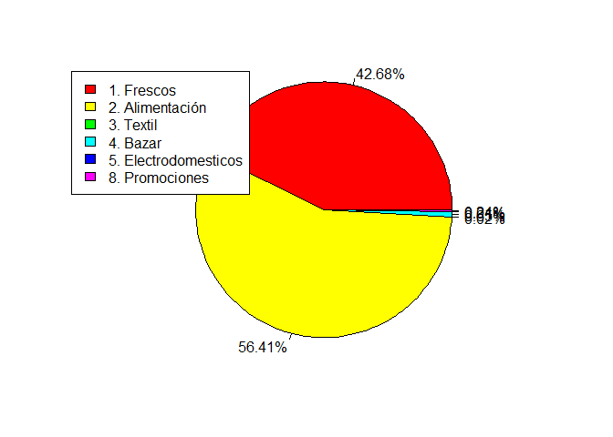
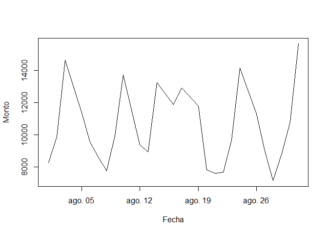
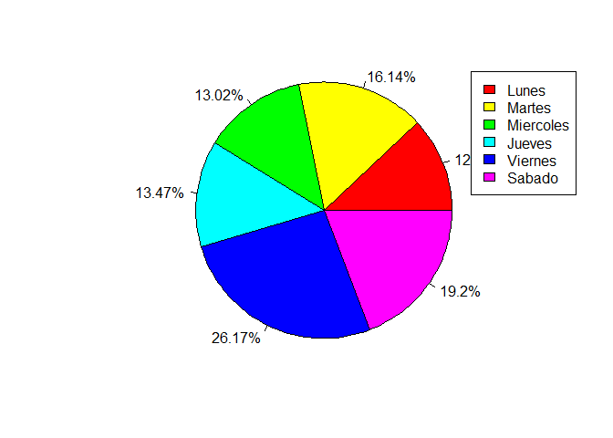
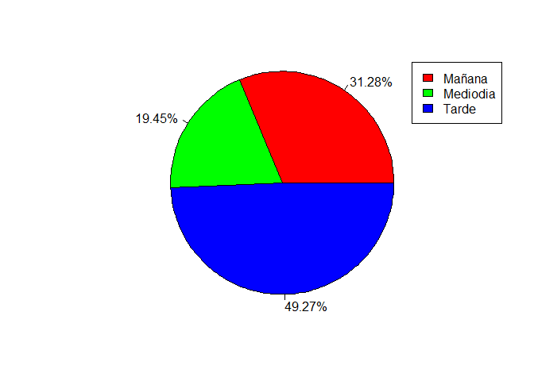

Grupo DataFun
================

# 0) Carga de data y librerias

``` r
setwd("D:/UAI/2022 - 1/Big Data/Tarea 1")
df <- read.csv("datosRetail.csv", header = TRUE, sep = ",")

library(plyr)
library(dplyr)
```

    ## 
    ## Attaching package: 'dplyr'

    ## The following objects are masked from 'package:plyr':
    ## 
    ##     arrange, count, desc, failwith, id, mutate, rename, summarise,
    ##     summarize

    ## The following objects are masked from 'package:stats':
    ## 
    ##     filter, lag

    ## The following objects are masked from 'package:base':
    ## 
    ##     intersect, setdiff, setequal, union

``` r
library(stringi)
```

# 1) Análisis exploratorio

## 1.1) Resumen de los datos

    ##        X          idTransaccion           dia                hora          
    ##  Min.   :     1   Min.   :3.156e+22   Length:162048      Length:162048     
    ##  1st Qu.: 40513   1st Qu.:3.156e+22   Class :character   Class :character  
    ##  Median : 81025   Median :3.156e+22   Mode  :character   Mode  :character  
    ##  Mean   : 81025   Mean   :3.156e+22                                        
    ##  3rd Qu.:121536   3rd Qu.:3.156e+22                                        
    ##  Max.   :162048   Max.   :3.156e+22                                        
    ##                                                                            
    ##    idTarjeta            idOferta           importe        idProducto      
    ##  Min.   :  7958452   Min.   :20166100   Min.   :0.009   Min.   :     547  
    ##  1st Qu.:255490591   1st Qu.:20196561   1st Qu.:0.909   1st Qu.:   44754  
    ##  Median :258945943   Median :20196573   Median :1.452   Median :13822986  
    ##  Mean   :282756032   Mean   :35663460   Mean   :1.674   Mean   : 9717816  
    ##  3rd Qu.:279568669   3rd Qu.:20199487   3rd Qu.:2.260   3rd Qu.:18410621  
    ##  Max.   :985881605   Max.   :99999204   Max.   :4.842   Max.   :23015290  
    ##                      NA's   :126743                                       
    ##  descProducto           idArea        descArea           idSeccion     
    ##  Length:162048      Min.   :1.000   Length:162048      Min.   : 1.000  
    ##  Class :character   1st Qu.:1.000   Class :character   1st Qu.: 3.000  
    ##  Mode  :character   Median :2.000   Mode  :character   Median : 6.000  
    ##                     Mean   :1.827                      Mean   : 7.322  
    ##                     3rd Qu.:2.000                      3rd Qu.:10.000  
    ##                     Max.   :8.000                      Max.   :32.000  
    ##                                                                        
    ##  descSeccion         idCategoria   descCategoria      idSubcategoria 
    ##  Length:162048      Min.   : 1.0   Length:162048      Min.   : 1.00  
    ##  Class :character   1st Qu.: 3.0   Class :character   1st Qu.: 1.00  
    ##  Mode  :character   Median :10.0   Mode  :character   Median : 5.00  
    ##                     Mean   :16.4                      Mean   :15.08  
    ##                     3rd Qu.:20.0                      3rd Qu.:20.00  
    ##                     Max.   :95.0                      Max.   :90.00  
    ##                                                                      
    ##  descSubcategoria     idSegmento    descSegmento          marca          
    ##  Length:162048      Min.   : 1.00   Length:162048      Length:162048     
    ##  Class :character   1st Qu.: 3.00   Class :character   Class :character  
    ##  Mode  :character   Median : 5.00   Mode  :character   Mode  :character  
    ##                     Mean   :10.97                                        
    ##                     3rd Qu.:15.00                                        
    ##                     Max.   :98.00                                        
    ##                                                                          
    ##   horaCompra         diaSemana        
    ##  Length:162048      Length:162048     
    ##  Class :character   Class :character  
    ##  Mode  :character   Mode  :character  
    ##                                       
    ##                                       
    ##                                       
    ## 

## 1.2) Total Ventas

    ## [1] 271327.4

## 1.3) Gráfico de ventas por área

<!-- -->

## 1.4) Gráfico de ventas del mes

<!-- -->

## 1.5) Gráfico de ventas por día de la semana

<!-- -->

## 1.6) Gráfico de ventas por hora del día

<!-- -->
